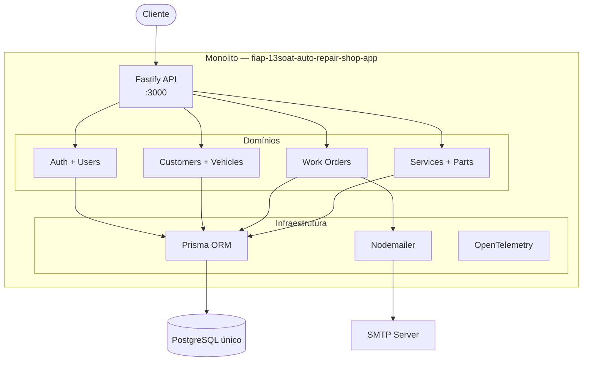
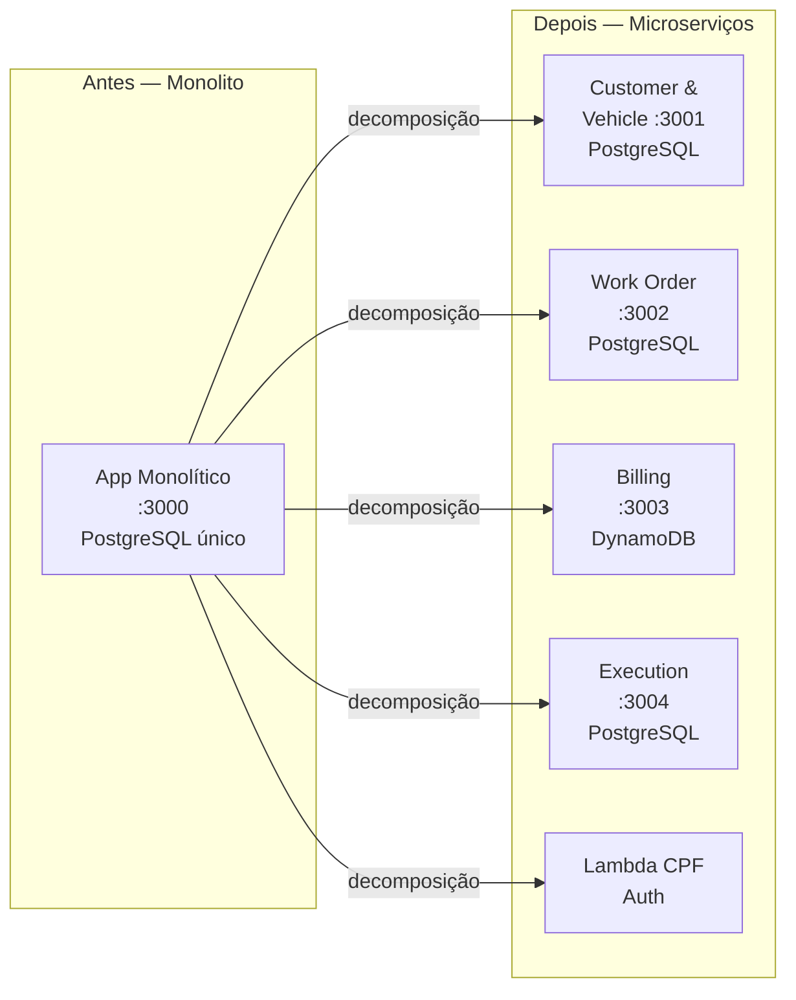

# App Monolítico — DEPRECIADO

> ⚠️ **ESTE REPOSITÓRIO ESTÁ DEPRECIADO** e não deve ser utilizado para novos deployments. Foi substituído pela arquitetura de microserviços composta por customer-vehicle-service, work-order-service, billing-service e execution-service.

## Sumário

- [1. Visão Geral](#1-visão-geral)
- [2. Arquitetura](#2-arquitetura)
- [3. Tecnologias Utilizadas](#3-tecnologias-utilizadas)
- [4. Comunicação entre Serviços](#4-comunicação-entre-serviços)
- [5. Diagramas](#5-diagramas)
- [6. Execução e Setup](#6-execução-e-setup)
- [7. Pontos de Atenção](#7-pontos-de-atenção)
- [8. Boas Práticas e Padrões](#8-boas-práticas-e-padrões)

---

> ## ⚠️ AVISO DE DEPRECIAÇÃO
>
> Este repositório contém o **monolito original** do sistema de oficina automotiva.
>
> **Ele foi decomposto em 4 microserviços independentes:**
>
> | Microserviço               | Responsabilidade                      |
> | -------------------------- | ------------------------------------- |
> | `customer-vehicle-service` | Cadastro de clientes e veículos       |
> | `work-order-service`       | Ordens de serviço + Saga Orchestrator |
> | `billing-service`          | Faturas e pagamentos                  |
> | `execution-service`        | Execução de serviços e notificações   |
>
> **Não faça deploy deste repositório em produção.** Mantenha-o apenas para referência histórica e contexto arquitetural.

---

## 1. Visão Geral

### Propósito (Histórico)

O **App Monolítico** foi a primeira versão do sistema de oficina automotiva. Em uma única aplicação Fastify, concentrava:

1. **Gestão de clientes e veículos** — cadastro com CPF/CNPJ
2. **Catálogo de serviços e peças** — tabelas de preços
3. **Ordens de Serviço** — criação, atualização, aprovação e cancelamento
4. **Gestão de usuários** — roles (Admin/Default), refresh tokens
5. **Autenticação JWT** — access token + refresh token
6. **Notificações** — e-mail via Nodemailer
7. **Métricas** — OpenTelemetry integrado

### Problema que Resolve (Contexto Histórico)

Esta foi a implementação inicial do sistema como **Tech Challenge FIAP**. Com o avanço do projeto, a arquitetura monolítica se tornou limitante para:

- Escalabilidade independente de componentes
- Deploys sem downtime
- Isolamento de falhas
- Divisão de responsabilidade entre times

A solução foi **decompor o monolito em microserviços** com comunicação assíncrona via SNS/SQS (Saga Pattern).

### Papel na Arquitetura (Atual)

| Papel                     | Status                       |
| ------------------------- | ---------------------------- |
| **Referência histórica**  | Mantido apenas para contexto |
| **Deploy em produção**    | ❌ NÃO FAZER                 |
| **Desenvolvimento ativo** | ❌ NÃO CONTINUAR             |

---

## 2. Arquitetura

### Clean Architecture (Monolítica)

```
src/
├── domain/
│   ├── entities/       # Customer, Vehicle, WorkOrder, Service, PartOrSupply, User
│   ├── enums/          # Status, Role
│   └── use-cases/      # Interfaces de use cases
├── application/        # Implementações dos use cases
├── infra/
│   ├── db/             # Prisma client + repositórios (PostgreSQL único)
│   ├── email/          # Nodemailer (SMTP)
│   └── observability/  # OpenTelemetry
├── presentation/       # Controllers Fastify
├── validation/         # Schemas Zod
└── main/               # Composition root
```

### Diferenças em Relação à Arquitetura de Microserviços

| Aspecto            | Monolito (este repo)           | Microserviços (atual)                     |
| ------------------ | ------------------------------ | ----------------------------------------- |
| **Deploy**         | Uma única imagem Docker        | 4 imagens independentes                   |
| **Banco de dados** | 1 PostgreSQL compartilhado     | PostgreSQL por serviço + DynamoDB         |
| **Comunicação**    | Chamadas internas (in-process) | SNS/SQS (assíncrono)                      |
| **Escalabilidade** | Toda a aplicação ou nada       | Escala por serviço                        |
| **Auth**           | Embutida na aplicação          | Lambda + API Gateway authorizer           |
| **Usuários**       | Tabela User com roles          | Não existe (só clientes via CPF)          |
| **Refresh tokens** | Implementado                   | Não implementado nos microserviços        |
| **E-mail**         | Nodemailer direto              | Via execution-service                     |
| **Saga/Pagamento** | Não existia                    | Saga Pattern completo com billing-service |

---

## 3. Tecnologias Utilizadas

| Tecnologia        | Versão | Propósito                        |
| ----------------- | ------ | -------------------------------- |
| **Node.js**       | 22     | Runtime                          |
| **TypeScript**    | 5.x    | Linguagem                        |
| **Fastify**       | 5.x    | Framework HTTP                   |
| **Prisma**        | 7      | ORM — todas as entidades         |
| **PostgreSQL**    | 16     | Banco de dados único             |
| **Nodemailer**    | 6      | Envio de e-mails                 |
| **jsonwebtoken**  | 9      | Auth JWT (access + refresh)      |
| **OpenTelemetry** | 1.x    | Métricas                         |
| **Jest**          | 29     | Testes                           |
| **Minikube**      | —      | Kubernetes local (infra/k8s/)    |
| **Terraform**     | —      | Infra local do Minikube (infra/) |

---

## 4. Comunicação entre Serviços

### Sem Mensageria

O monolito **não usa mensageria**. Toda comunicação é síncrona e in-process.

### Endpoints REST (Histórico)

| Grupo              | Rotas                                                                             |
| ------------------ | --------------------------------------------------------------------------------- |
| **Auth**           | `POST /api/auth/login`, `POST /api/auth/refresh`, `POST /api/auth/logout`         |
| **Users**          | `POST/GET/PUT/DELETE /api/users`                                                  |
| **Customers**      | `POST/GET/PUT/DELETE /api/customers`                                              |
| **Vehicles**       | `POST/GET/PUT/DELETE /api/vehicles`                                               |
| **Services**       | `POST/GET/PUT/DELETE /api/services`                                               |
| **Parts/Supplies** | `POST/GET/PUT/DELETE /api/parts-or-supplies`                                      |
| **Work Orders**    | `POST/GET/PUT/DELETE /api/work-orders`, `PATCH /:id/approve`, `PATCH /:id/cancel` |
| **Metrics**        | `GET /api/metrics`                                                                |
| **Health**         | `GET /health`                                                                     |

### Funcionalidades Não Migradas

As seguintes features existiam no monolito mas **não foram migradas** para os microserviços:

- **Gestão de usuários (User/Role)** — microserviços usam apenas autenticação via CPF de clientes
- **Refresh tokens** — microserviços só emitem access tokens via Lambda
- **Métricas agregadas via endpoint** (`/api/metrics`) — substituído por OTel/Prometheus/Grafana

---

## 5. Diagramas

### Arquitetura Monolítica (Histórico)


```mermaid
graph TD
    Client([Cliente])
    subgraph "Monolito — fiap-13soat-auto-repair-shop-app"
        Fastify[Fastify API\n:3000]
        subgraph "Domínios"
            Auth[Auth + Users]
            CV[Customers + Vehicles]
            WO[Work Orders]
            Cat[Services + Parts]
        end
        subgraph "Infraestrutura"
            Prisma[Prisma ORM]
            Mail[Nodemailer]
            OTel[OpenTelemetry]
        end
    end
    PG[(PostgreSQL único)]
    SMTP[SMTP Server]

    Client --> Fastify
    Fastify --> Auth & CV & WO & Cat
    Auth & CV & WO & Cat --> Prisma --> PG
    WO --> Mail --> SMTP
```

### Evolução para Microserviços


```mermaid
graph LR
    subgraph "Antes — Monolito"
        M[App Monolítico\n:3000\nPostgreSQL único]
    end
    subgraph "Depois — Microserviços"
        CV2[Customer &\nVehicle :3001\nPostgreSQL]
        WO2[Work Order\n:3002\nPostgreSQL]
        BI2[Billing\n:3003\nDynamoDB]
        EX2[Execution\n:3004\nPostgreSQL]
        L[Lambda CPF\nAuth]
    end
    M -->|decomposição| CV2 & WO2 & BI2 & EX2 & L
```

---

## 6. Execução e Setup

> ⚠️ **Não recomendado para uso ativo.** Instruções mantidas apenas para referência histórica.

### Rodando Localmente (Referência)

```bash
yarn install
yarn prisma:generate
yarn prisma:migrate
yarn dev
```

### Via Docker Compose (Referência)

```bash
docker compose up -d --build
```

### Variáveis de Ambiente (Histórico)

| Variável                   | Descrição                    |
| -------------------------- | ---------------------------- |
| `SERVER_PORT`              | Porta (default: `3000`)      |
| `DATABASE_URL`             | Connection string PostgreSQL |
| `JWT_ACCESS_TOKEN_SECRET`  | Chave JWT access token       |
| `JWT_REFRESH_TOKEN_SECRET` | Chave JWT refresh token      |
| `SMTP_HOST`, `SMTP_PORT`   | Configuração SMTP            |
| `SMTP_USER`, `SMTP_PASS`   | Credenciais SMTP             |

---

## 7. Pontos de Atenção

### Por que foi Depreciado

O monolito foi depreciado por limitações arquiteturais que se tornaram aparentes durante o desenvolvimento:

1. **Sem isolamento de falhas** — um bug em qualquer módulo derruba toda a aplicação
2. **Escalabilidade tudo-ou-nada** — não é possível escalar apenas o módulo de pagamentos
3. **Deploy acoplado** — qualquer mudança requer rebuild e redeploy de toda a aplicação
4. **Sem mensageria** — operações financeiras síncronas são frágeis em produção

### O que Foi Preservado nos Microserviços

- **Estrutura de Clean Architecture** — mantida em todos os microserviços
- **Validação com Zod** — mantida e expandida
- **OpenTelemetry** — mantido e aprimorado com Prometheus/Grafana
- **Fastify** — mantido como framework HTTP

### O que Não Foi Migrado

- **Gestão de usuários (User/Role/Admin)** — microserviços são para clientes
- **Refresh tokens** — Lambda emite apenas access tokens
- **Endpoint `/api/metrics`** — substituído por Prometheus/Grafana

---

## 8. Boas Práticas e Padrões

Esta seção documenta os padrões estabelecidos no monolito e que foram **evoluídos** nos microserviços. Serve como referência para entender as decisões de design.

### Segurança (Monolito)

- JWT com access + refresh tokens
- bcrypt para hash de senhas de usuários
- Roles (Admin/Default) para controle de acesso

### Segurança (Microserviços — Evolução)

- JWT apenas (sem refresh) via Lambda CPF Auth
- Sem usuários — apenas clientes autenticados via CPF
- API Gateway JWT Authorizer centralizado

### Convenções Mantidas

- **Clean Architecture** com camadas explícitas
- **Zod** para validação de entrada
- **Pino** para logging estruturado JSON
- **OpenTelemetry** para observabilidade
- **Fastify** como framework HTTP

### Aprendizados do Monolito

- Banco de dados único facilita desenvolvimento inicial mas complica escalabilidade
- Comunicação síncrona cria acoplamento temporal (se o receptor cai, o emissor falha)
- Ausência de mensageria torna impossível implementar padrões como Saga, Outbox, Idempotência
- Testes de integração no monolito são mais simples mas menos representativos de falhas reais
